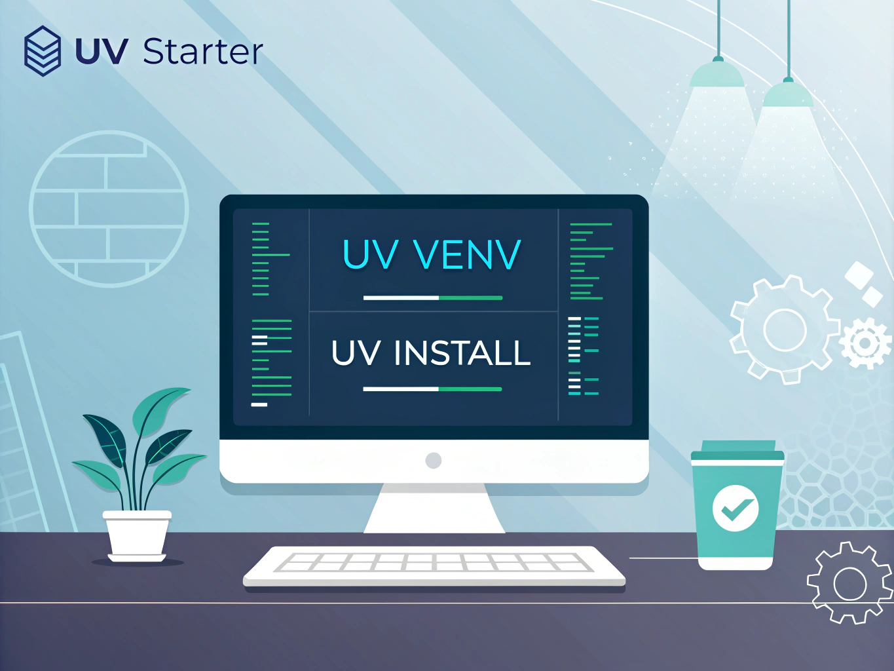

<div align="center">
  
  
  # UV Starter
</div>

`uv` is a lightweight and efficient tool for managing Python virtual environments and dependencies. It simplifies managing isolated environments for different projects, ensuring reproducibility and minimal interference between dependencies.

## Installation

To install `uv`, use the following one-liner:

```bash
curl -LsSf https://astral.sh/uv/install.sh | sh
```

This will download and install the latest version of `uv`.

## Setup

For seamless integration with your shell, add the following setup to your `.zshrc` or `.bashrc` file. This ensures that:

1. A default virtual environment (`base`) is always active if no other environment is activated.
2. The `pip` command is overridden to use `uv pip`.
3. A utility function `activate` is provided to deactivate an existing environment before activating a new one.

```bash
# UV virtual environment
export UV_DEFAULT_VENV="base"
if [ -z "$VIRTUAL_ENV" ]; then  # Only activate if no venv is currently active
    if [ ! -d "$HOME/.venv/$UV_DEFAULT_VENV" ]; then
        uv venv "$HOME/.venv/$UV_DEFAULT_VENV"
    fi
    source "$HOME/.venv/$UV_DEFAULT_VENV/bin/activate"
fi

# Make UV the default pip installer
alias pip="uv pip"

# Deactivate any existing venv before activating a new one
function activate() {
    if [ -n "$VIRTUAL_ENV" ]; then
        deactivate
    fi
    source "$1/bin/activate"
}
```

## Managing Environments with `uv`

### Creating a New Virtual Environment

To create a new virtual environment:

```bash
uv venv path/to/env
```

### Activating a Virtual Environment

Use the `activate` function from your setup:

```bash
activate path/to/env
```

This ensures any currently active environment is deactivated before activating the new one.

### Installing Dependencies

To install a package in the currently active environment:

```bash
uv pip install <package-name>
```

### Installing from `pyproject.toml`

`uv` supports installing dependencies defined in `pyproject.toml` into the respective virtual environments. To install dependencies:

1. Ensure you are in the directory with the `pyproject.toml` file.
2. Run:

```bash
uv install
```

This will read the `pyproject.toml` file and install the specified dependencies into the active environment.

## Uninstalling `uv`

If you need to remove `uv`, you can do so by deleting the installed binary:

```bash
rm -f /usr/local/bin/uv
```

## Troubleshooting

If you encounter issues or have questions, check the [official documentation](https://astral.sh/uv/) or raise an issue on the repository.

Happy coding with `uv`!
